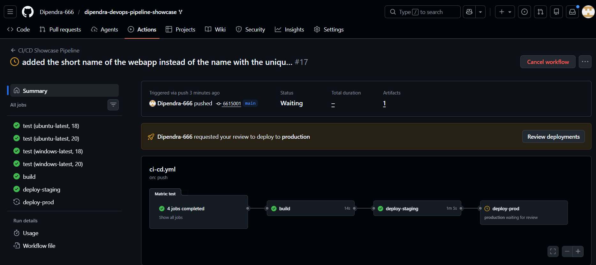
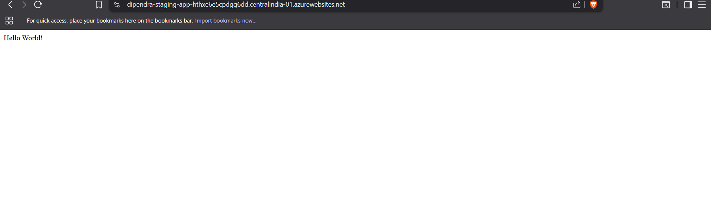
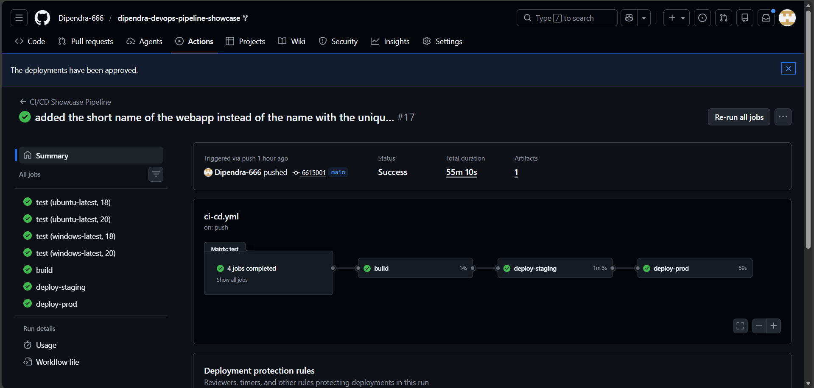

# CI/CD Pipeline Showcase – Node.js App to Azure App Service

Full end-to-end CI/CD pipeline built with GitHub Actions, deploying a simple Node.js "Hello World" Express app to Azure App Service (staging + production environments).

This project demonstrates modern DevOps practices suitable for mid-level roles: automated testing, caching, artifact management, secure authentication (OIDC), multi-environment deployment, and gated production releases.

## Features

- **CI**:
  - Parallel matrix testing (Node 18 & 20 × Ubuntu & Windows-latest)
  - ESLint linting
  - Jest unit/integration tests
  - npm caching for fast builds

- **Build & Artifact**:
  - Single build job on Node 20
  - Creates `dist/` folder → uploads as artifact

- **CD**:
  - Secure login to Azure using **OIDC federation** (no secrets in repo)
  - Auto-deploy to **staging** environment
  - Manual approval gate before deploy to **production**
  - Real deployment to Azure App Service (Linux, Node 22 LTS)

## Architecture / Flow

1. Push or PR to `main` → trigger workflow
2. Run test matrix (4 jobs) → lint + unit tests
3. Build job → `npm run build` → upload `dist/` artifact
4. Deploy to **staging** (automatic, no approval)
5. Deploy to **production** (pauses → requires manual approval from me)
6. Live on Azure: staging auto-updates, production gated

## Screenshots

### 1. Full GitHub Actions Workflow Run
Shows matrix testing (4 jobs), build, artifact upload, staging deploy, and production waiting for manual review.



### 2. Live Staging App
"Hello World!" successfully deployed to staging environment (auto-deploy).



### 3. Complete Successful Run (after approving production)
All jobs green – production deployed after manual approval.



## Technologies Used

- GitHub Actions
- Azure App Service (F1 free tier, Linux, Node 22 LTS)
- OIDC (OpenID Connect) workload identity federation
- Node.js + Express
- ESLint + Jest + Supertest
- npm caching & artifacts

## Repository Structure (important files)

- `.github/workflows/ci-cd.yml` → full pipeline definition
- `index.js` → simple Express server
- `package.json` → scripts, deps, build command
- `dist/` → build output (index.js + package.json + node_modules)

## Lessons Learned

- F1 free tier quota limits (60 CPU min/day) → can disable site after repeated deploys/tests
- Azure App Service cold starts + runtime `npm install` can cause initial 504/Application Error
- OIDC setup (federated credentials for branch + environments) is more secure than secrets
- Manual approval gates in production are essential for real-world safety
- **Jest hanging / open handle error** → fixed with `--forceExit` flag on `npm test` to force exit after tests 

## How to Run Locally

```bash
npm install
npm run build
npm start


Visit http://localhost:3000 → "Hello World!"